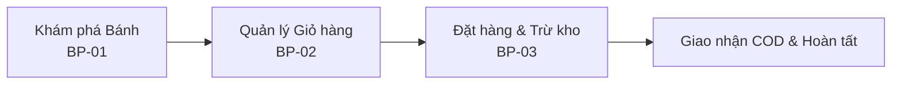

# Memory Lane Sweets - B2C Bakery E-Commerce System

> **Hệ thống Website Thương mại Điện tử B2C Bán Bánh Ngọt Trực Tuyến**  
> **Dự án**: Bài tập lớn Phân tích Thiết kế & Lập trình Web (Fintech) 

---

## 1. PROJECT OVERVIEW

**Memory Lane Sweets** là hệ thống website thương mại điện tử theo mô hình **B2C (Business-to-Consumer)** phục vụ hoạt động kinh doanh trực tuyến cho cửa hàng bánh tươi, bánh ngọt thủ công, bánh sinh nhật và bánh mặn.

Hệ thống cung cấp kênh mua sắm 24/7 giúp khách hàng duyệt thực đơn trực quan, tìm kiếm theo tên bánh, lọc theo khoảng giá, quản lý giỏ hàng với cơ chế **kiểm soát tồn kho theo thời gian thực (Real-time Inventory Check)** và hoàn tất đặt hàng thanh toán khi nhận hàng (COD) chỉ trong 3 bước thao tác tinh gọn.

---

## 2. BUSINESS PROBLEM

1. **Phụ thuộc vào địa điểm vật lý**: Các cửa hàng bánh truyền thống bị giới hạn phạm vi tiếp cận khách hàng trong khu vực lân cận và khung giờ mở cửa cố định.
2. **Sai lệch tồn kho theo ngày**: Bánh tươi có đặc thù hạn sử dụng ngắn và sản xuất theo mẻ giới hạn trong ngày. Việc chốt đơn thủ công qua điện thoại/tin nhắn dễ dẫn đến tình trạng bán vượt số lượng thực tế còn lại (overselling).
3. **Thiếu kênh trưng bày trực quan**: Khách hàng khó theo dõi đầy đủ bảng giá, thành phần, kích cỡ và các mẫu bánh kem sinh nhật mới nếu không đến trực tiếp cửa hàng.

---

## 3. BUSINESS OBJECTIVES

* **Chuyển đổi số kênh bán lẻ**: Xây dựng website thương mại điện tử chuyên nghiệp, tự động hóa quy trình tiếp nhận đơn hàng 24/7. `[Documented]`
* **Tự động hóa kiểm soát tồn kho**: Ngăn chặn thêm vào giỏ vượt quá số lượng tồn kho khả dụng và tự động trừ số lượng trong CSDL ngay khi đơn hàng được thiết lập thành công. `[Documented]` `[Implemented]`
* **Tối ưu trải nghiệm mua hàng**: Rút ngắn quy trình mua hàng xuống dưới 5 lượt nhấp chuột (Giỏ hàng $\rightarrow$ Giao hàng $\rightarrow$ Thanh toán COD $\rightarrow$ Thành công). `[Documented]` `[Implemented]`

---

## 4. PROJECT SCOPE

### 4.1. In Scope (Đã triển khai & Có bằng chứng)
* **Trưng bày & Tìm kiếm (Storefront)**: Trang chủ với Top 6 bánh mới (`createdAt DESC`) và Top 3 bánh bán chạy (`SUM(od.quantity)`), xem 4 danh mục chính, bộ lọc theo 4 phân khúc giá, xem chi tiết bánh kèm gợi ý Top 4 bánh liên quan, tìm kiếm theo từ khóa tên bánh. `[Implemented]`
* **Giỏ hàng & Kiểm soát Tồn kho**: Thêm bánh vào giỏ, cập nhật số lượng có kiểm tra tồn kho (`quantity <= available`), xóa sản phẩm khỏi giỏ, tự động tính tổng tiền bằng `BigDecimal`. `[Implemented]`
* **Đặt hàng & Khấu trừ Kho (Checkout & Fulfillment)**: Thu thập thông tin người nhận (Họ tên, SĐT, Địa chỉ), cố định phí ship 20.000 VNĐ, chọn thanh toán COD, ghi nhận bảng `Orders` và `OrderDetails`, tự động trừ kho trong bảng `Cakes`. `[Implemented]`
* **Cơ sở dữ liệu trung tâm**: CSDL quan hệ Microsoft SQL Server (`WebBanBanhDB`) chuẩn hóa 3NF gồm 6 bảng liên kết chặt chẽ. `[Implemented]`

### 4.2. Out of Scope (Lộ trình phát triển mở rộng - Phase 2 Roadmap)
* Tích hợp cổng thanh toán trực tuyến bên thứ ba (VNPay, MoMo, ZaloPay, Thẻ tín dụng quốc tế). `[Documented]`
* Tính phí vận chuyển tự động theo khoảng cách địa lý / API đơn vị vận chuyển bên ngoài (GHTK, GHN). `[Documented]`
* Giao diện và Controller cho phân hệ Quản trị Admin (CRUD sản phẩm, duyệt đơn hàng). `[Documented - Gap]`
* Phân hệ Đăng ký / Đăng nhập / Quản lý Hồ sơ thành viên phía Client. `[Documented - Gap]`

---

## 5. STAKEHOLDERS

| Stakeholder | Phân loại | Vai trò chính | Trách nhiệm & Mối quan tâm cốt lõi |
| :--- | :--- | :--- | :--- |
| **Khách hàng vãng lai (Guest)** | End User | Người mua hàng trực tuyến | Mua hàng nhanh, không ép tạo tài khoản, kiểm tra rõ giá và tồn kho khả dụng. |
| **Khách hàng thành viên (Member)**| End User | Người mua hàng định danh | Quản lý địa chỉ giao hàng cá nhân, xem lịch sử đơn hàng, gửi đánh giá bánh. |
| **Quản trị viên (Store Admin)** | Admin / Internal | Chủ tiệm & Quản lý vận hành | Quản lý menu bánh, kiểm soát tồn kho theo ngày, xử lý và cập nhật trạng thái đơn. |
| **Hệ thống CSDL (SQL Server)** | System | Tầng lưu trữ trung tâm | Duy trì tính toàn vẹn dữ liệu quan hệ (ACID), thực thi các ràng buộc khóa và logic trừ kho. |
| **Máy chủ Ứng dụng (Tomcat)** | System | Tầng điều phối nghiệp vụ | Tiếp nhận HTTP Request, điều phối Servlet MVC, duy trì Session giỏ hàng 30 phút. |
| **Đơn vị giao hàng (Shipper)** | External | Vận chuyển & Thu hộ | Nhận thông tin địa chỉ, giao bánh đúng hẹn và thu tiền mặt COD. |

Chi tiết xem tại: [`docs/01-business/02-stakeholder-analysis.md`](docs/01-business/02-stakeholder-analysis.md).

---

## 6. KEY BUSINESS PROCESSES

Hệ thống mô hình hóa 3 quy trình cốt lõi và 4 quy trình quản trị mở rộng:



1. **BP-01: Khám phá, Tìm kiếm & Lọc Sản phẩm**: Duyệt Trang chủ $\rightarrow$ Chọn Danh mục $\rightarrow$ Lọc theo 4 khoảng giá $\rightarrow$ Xem Chi tiết bánh & Bánh liên quan.
2. **BP-02: Quản lý Giỏ hàng & Kiểm soát Tồn kho**: Thêm bánh vào giỏ $\rightarrow$ Kiểm tra `totalQuantity <= available` $\rightarrow$ Tự động tính tổng tiền $\rightarrow$ Cảnh báo nếu vượt tồn kho.
3. **BP-03: Đặt hàng, Lưu Hóa đơn & Khấu trừ Tồn kho**: Nhập thông tin người nhận $\rightarrow$ Chọn thanh toán COD $\rightarrow$ Lưu `Orders` & `OrderDetails` $\rightarrow$ Tự động `UPDATE Cakes SET quantity = quantity - ?` $\rightarrow$ Xóa giỏ hàng Session.

Chi tiết xem tại: [`docs/03-process/01-business-processes.md`](docs/03-process/01-business-processes.md).

---

## 7. KEY FEATURES & MODULE MAP

| Feature ID | Tên Tính năng | Mô tả Nghiệp vụ | Giao diện (JSP) | Controller (Servlet) | Trạng thái |
| :--- | :--- | :--- | :--- | :--- | :--- |
| **F001** | **Trang chủ & Bánh nổi bật** | Hiển thị Top 6 bánh mới và Top 3 bánh bán chạy nhất | `trangchu.jsp` | `HomeServlet` (`/home`) | **Implemented** |
| **F002** | **Menu Danh mục chính** | Điều hướng phân loại 4 nhóm bánh chính | `menu-page.jsp` | `MenuServlet` (`/menu`) | **Implemented** |
| **F003** | **Danh mục & Lọc giá** | Lọc bánh theo 4 khoảng giá (0-100k, 100-200k, 200-300k, >300k) | `product-category.jsp` | `CategoryServlet` (`/category`) | **Implemented** |
| **F004** | **Chi tiết Sản phẩm** | Xem thông số bánh, tồn kho thực tế và Top 4 bánh liên quan | `product-detail.jsp` | `ProductDetailServlet` (`/product-detail`) | **Implemented** |
| **F005** | **Tìm kiếm theo Tên** | Tra cứu nhanh bánh theo từ khóa chứa trong tên bánh | `search-results.jsp` | `SearchServlet` (`/search`) | **Implemented** |
| **F006** | **Quản lý Giỏ hàng** | Thêm, sửa số lượng, kiểm tra vượt tồn kho, xóa món | `cart.jsp` | `CartServlet` (`/cart`) | **Implemented** |
| **F007** | **Giao hàng (Checkout)** | Nhập Họ tên, Số điện thoại, Địa chỉ người nhận bắt buộc | `checkout.jsp` | `CheckoutServlet` (`/checkout`) | **Implemented** |
| **F008** | **Thanh toán & Trừ kho** | Xác nhận COD, cộng 20k phí ship, tạo đơn hàng và trừ kho | `payment.jsp` | `PaymentServlet` (`/payment`) | **Implemented** |
| **F009** | **Tài khoản & Hồ sơ** | Đăng ký, đăng nhập, quản lý hồ sơ và lịch sử đơn | `header.jsp` *(links)* | *Roadmap Phase 2* | **Gap** |
| **F010** | **Quản trị Sản phẩm** | Thêm, sửa, xóa bánh và cập nhật giá/tồn kho (Admin) | *Admin Views* | *Roadmap Phase 2* | **Gap** |
| **F011** | **Quản trị Đơn hàng** | Cập nhật trạng thái đơn (Chờ xác nhận $\rightarrow$ Đang giao...) | *Admin Views* | *Roadmap Phase 2* | **Gap** |

Chi tiết xem tại: [`docs/04-functional/01-feature-module-map.md`](docs/04-functional/01-feature-module-map.md).

---

## 8. REQUIREMENTS SUMMARY

* **Business Requirements (BR-001 $\rightarrow$ BR-005)**: Kênh bán hàng online 24/7, kiểm soát tồn kho thời gian thực, tự động hóa đơn COD, quản trị tập trung, thu thập đánh giá. [`docs/02-requirements/01-business-requirements.md`](docs/02-requirements/01-business-requirements.md)
* **Functional Requirements (FR-001 $\rightarrow$ FR-016)**: Đặc tả chi tiết 16 chức năng từ Trang chủ, Bộ lọc giá, Giỏ hàng Session, Đặt hàng đến Quản trị Admin. [`docs/02-requirements/02-functional-requirements.md`](docs/02-requirements/02-functional-requirements.md)
* **Non-Functional Requirements (NFR-001 $\rightarrow$ NFR-006)**: Usability (Quy tắc 5 click), Performance (sub-2s), Data Integrity (ACID, `DECIMAL(18,0)`), Architecture MVC, Security (Session 30 phút, chống SQL Injection qua `PreparedStatement`). [`docs/02-requirements/03-non-functional-requirements.md`](docs/02-requirements/03-non-functional-requirements.md)
* **User Stories & Use Cases (US-01 $\rightarrow$ US-05)**: Đặc tả chuẩn Agile kèm Tiêu chí chấp nhận (Acceptance Criteria) và luồng ngoại lệ. [`docs/02-requirements/04-user-stories-and-use-cases.md`](docs/02-requirements/04-user-stories-and-use-cases.md)

---

## 9. CORE BUSINESS RULES

| Rule ID | Nhóm quy tắc | Phát biểu Quy tắc Nghiệp vụ cốt lõi | Vị trí triển khai kỹ thuật |
| :--- | :--- | :--- | :--- |
| **BR-STK-01** | **Stock Validation** | Số lượng thêm/sửa trong giỏ không được vượt quá số lượng tồn kho (`quantity <= available`). Nếu vượt quá $\rightarrow$ chặn và hiển thị lỗi: *"Số lượng cập nhật vượt quá tồn kho. Chỉ còn [available] sản phẩm."* | `CartServlet.java:L71-74, L94-97` |
| **BR-STK-02** | **Inventory Deduction** | Ngay khi đặt hàng thành công, tự động thực thi câu lệnh SQL trừ tồn kho: `UPDATE Cakes SET quantity = quantity - ? WHERE cakeID = ?`. | `PaymentServlet.java`, `CakeDAO.java:L1044` |
| **BR-CRT-01** | **Cart Min Quantity** | Số lượng mỗi món trong giỏ phải $\ge 1$. Nếu sửa về $\le 0 \rightarrow$ tự động xóa khỏi giỏ hàng. | `CartServlet.java:L86-88` |
| **BR-SHP-01** | **Shipping Fee** | Áp dụng mức phí vận chuyển cố định **20.000 VNĐ** cho hình thức giao tận nơi. Tổng đơn = `Tổng tiền hàng + 20.000 VNĐ`. | `sidebar-checkout.jsp`, `payment.jsp` |
| **BR-PAY-01** | **Payment Method** | Phương thức thanh toán mặc định và duy nhất đang hỗ trợ giao dịch là **Thanh toán khi nhận hàng (COD)**. | `payment.jsp`, `PaymentServlet.java` |
| **BR-ORD-01** | **Mandatory Fields** | Khi đặt hàng, khách hàng bắt buộc phải nhập đủ 3 trường: Họ tên (`name`), SĐT (`phone`), Địa chỉ (`address`). | `checkout.jsp` (HTML5 `required`) |
| **BR-ORD-02** | **Initial State** | Mọi đơn đặt hàng mới tạo thành công đều có trạng thái khởi tạo là **"Chờ xác nhận"**. | `PaymentServlet.java:L520`, `sql.sql` |
| **BR-PRC-01** | **Price Filtering** | Bộ lọc giá phân chia cố định 4 mức: Dưới 100k, 100k-200k, 200k-300k, trên 300k. | `CategoryServlet.java:L209-223` |

Chi tiết toàn bộ 14 quy tắc nghiệp vụ xem tại: [`docs/01-business/03-business-rules.md`](docs/01-business/03-business-rules.md).

---

## 10. REQUIREMENT TRACEABILITY MATRIX (RTM)

Hệ thống thiết lập chuỗi truy vết xuyên suốt 8 tầng từ **BR $\rightarrow$ UR $\rightarrow$ FR $\rightarrow$ US/UC $\rightarrow$ Rule $\rightarrow$ Feature $\rightarrow$ UI $\rightarrow$ Servlet $\rightarrow$ Code $\rightarrow$ Status**.

* **Độ bao phủ chuỗi bán hàng cốt lõi**: **100% Complete** (10/10 chức năng Storefront hoạt động hoàn chỉnh từ Giao diện đến CSDL).
* **Độ bao phủ toàn hệ thống**: **62.5% Complete** | **37.5% Roadmap Gaps** (được định vị rõ ràng cho giai đoạn 2).

Chi tiết ma trận RTM đầy đủ xem tại: [`docs/08-traceability/01-requirement-traceability-matrix.md`](docs/08-traceability/01-requirement-traceability-matrix.md).

---

## 11. BA DELIVERABLES & ARTIFACT INVENTORY

Toàn bộ tài liệu nghiệp vụ đã được số hóa và chuẩn hóa theo chuẩn quốc tế trong thư mục `docs/`:

1. **Business Analysis**: [`docs/01-business/01-business-overview.md`](docs/01-business/01-business-overview.md)
2. **Stakeholder Analysis**: [`docs/01-business/02-stakeholder-analysis.md`](docs/01-business/02-stakeholder-analysis.md)
3. **Business Rules Catalog**: [`docs/01-business/03-business-rules.md`](docs/01-business/03-business-rules.md)
4. **Business Requirements (BR)**: [`docs/02-requirements/01-business-requirements.md`](docs/02-requirements/01-business-requirements.md)
5. **Functional Requirements (FR)**: [`docs/02-requirements/02-functional-requirements.md`](docs/02-requirements/02-functional-requirements.md)
6. **Non-Functional Requirements (NFR)**: [`docs/02-requirements/03-non-functional-requirements.md`](docs/02-requirements/03-non-functional-requirements.md)
7. **User Stories & Use Case Specifications**: [`docs/02-requirements/04-user-stories-and-use-cases.md`](docs/02-requirements/04-user-stories-and-use-cases.md)
8. **Business Process Models (Mermaid Diagrams)**: [`docs/03-process/01-business-processes.md`](docs/03-process/01-business-processes.md)
9. **Feature & Module Map**: [`docs/04-functional/01-feature-module-map.md`](docs/04-functional/01-feature-module-map.md)
10. **Business Data Dictionary**: [`docs/05-data/01-business-data-dictionary.md`](docs/05-data/01-business-data-dictionary.md)
11. **Entity Relationship Diagram (ERD)**: [`docs/05-data/02-erd-data-model.md`](docs/05-data/02-erd-data-model.md)
12. **System Context & Architecture**: [`docs/06-integration/01-system-context-and-architecture.md`](docs/06-integration/01-system-context-and-architecture.md)
13. **Test Cases & UAT Scenarios (27 Test Cases)**: [`docs/07-testing/01-test-cases-and-uat.md`](docs/07-testing/01-test-cases-and-uat.md)
14. **Requirement Traceability Matrix (RTM)**: [`docs/08-traceability/01-requirement-traceability-matrix.md`](docs/08-traceability/01-requirement-traceability-matrix.md)
15. **Documentation Gap Analysis**: [`docs/09-analysis/01-gap-analysis.md`](docs/09-analysis/01-gap-analysis.md)
16. **BA Portfolio Highlights**: [`docs/09-analysis/02-ba-portfolio-highlights.md`](docs/09-analysis/02-ba-portfolio-highlights.md)
17. **BA Documentation Audit Report**: [`docs/09-analysis/BA_DOCUMENTATION_AUDIT.md`](docs/09-analysis/BA_DOCUMENTATION_AUDIT.md)

---

## 12. TECHNICAL / SYSTEM ARCHITECTURE OVERVIEW

```
+-------------------------------------------------------------------------+
|                  1. PRESENTATION LAYER (TẦNG TRÌNH DIỄN)                 |
|  JSP 2.3, JSTL 1.2, HTML5, CSS3, JavaScript (DOM Validation, Slider)     |
|  Font Awesome 6.5.2 (CDN), Google Fonts (Dancing Script)                |
+-------------------------------------------------------------------------+
                                    |  HTTP GET / POST
                                    v
+-------------------------------------------------------------------------+
|             2. APPLICATION LAYER (TẦNG NGHIỆP VỤ & ĐIỀU PHỐI)           |
|  Apache Tomcat 10+, Jakarta EE 10 (Servlet 6.0)                         |
|  Controllers: HomeServlet, CategoryServlet, ProductDetailServlet...      |
|  Session Management: Cart State, Inventory Reservation, PRG Pattern      |
+-------------------------------------------------------------------------+
                                    |  Java JDBC Calls
                                    v
+-------------------------------------------------------------------------+
|             3. DATA ACCESS LAYER & DATABASE (TẦNG DỮ LIỆU)              |
|  Data Access Objects: CakeDAO.java, OrderDAO.java, DBUtils.java          |
|  RDBMS: Microsoft SQL Server 2019+ (Port 1433, Database: WebBanBanhDB)  |
+-------------------------------------------------------------------------+
```

* **Tech Stack**:
  * **Backend**: Java (JDK 17+), Jakarta EE 10 Servlet / JSP, JDBC API.
  * **Frontend**: HTML5, Vanilla CSS3, JavaScript, JSTL Core / Formatting.
  * **Database**: Microsoft SQL Server (Transact-SQL).
  * **Build Tool & Server**: Apache Maven, Apache Tomcat 10.1+.

---

## 13. REPOSITORY STRUCTURE

```text
├── docs/                                      # TOÀN BỘ 17 TÀI LIỆU BA CHUYÊN SÂU
├── code java/                                 # MÃ NGUỒN DỰ ÁN MAVEN JAVA WEB
│   ├── pom.xml                                # Cấu hình dependencies (Jakarta EE, JSTL)
│   └── src/main/
│       ├── java/com/webbanbanh/
│       │   ├── controller/                    # Các Servlet tiếp nhận request
│       │   ├── dao/                           # Lớp truy vấn CSDL (CakeDAO, OrderDAO)
│       │   ├── model/                         # JavaBean Entities (Cake, Order, Cart...)
│       │   └── utils/                         # Tiện ích kết nối JDBC (DBUtils)
│       └── webapp/
│           ├── WEB-INF/view/                  # Các trang JSP hiển thị giao diện
│           ├── css/                           # Các stylesheet định dạng
│           └── images/                        # Tài nguyên hình ảnh sản phẩm bánh
├── sql.sql                                    # SCRIPT DDL KHỞI TẠO CSDL SQL SERVER
├── test case.xlsx                             # FILE EXCEL TEST CASES GỐC (27 KỊCH BẢN)
├── Tài liệu phân tích_.docx                   # BÁO CÁO ĐỒ ÁN GỐC (WORD 67 TRANG)
└── README.md                                  # HỒ SƠ TỔNG QUAN DỰ ÁN PORTFOLIO
```

---

## 14. GETTING STARTED & INSTALLATION

### Yêu cầu tiên quyết (Prerequisites)
* Java Development Kit (JDK) 17 trở lên.
* Apache Maven 3.8+.
* Apache Tomcat 10.1+.
* Microsoft SQL Server 2019+ (hoặc Azure SQL Edge).
* IDE: NetBeans 18+, IntelliJ IDEA Ultimate, Eclipse, hoặc VS Code.

### Hướng dẫn 5 bước cài đặt & chạy hệ thống

1. **Khởi tạo Cơ sở dữ liệu**:
   * Mở SQL Server Management Studio (SSMS).
   * Mở file `sql.sql` và thực thi toàn bộ script để tạo database `WebBanBanhDB`, các bảng và dữ liệu mẫu.

2. **Cấu hình Kết nối CSDL (Biến môi trường hoặc .env)**:
   * Thiết lập các biến môi trường kết nối CSDL (hoặc tham khảo file `.env.example`):
     ```bash
     DB_HOST=localhost
     DB_PORT=1433
     DB_NAME=WebBanBanhDB
     DB_USER=your_database_user
     DB_PASSWORD=your_database_password
     ```
   * Hệ thống tự động nạp cấu hình qua `DBUtils.java` (`System.getenv` / `System.getProperty`).

3. **Build Dự án bằng Maven**:
   * Di chuyển vào thư mục `code java`:
     ```bash
     mvn clean install
     ```

4. **Triển khai trên Apache Tomcat**:
   * Cấu hình server Apache Tomcat trong IDE (NetBeans/IntelliJ) và deploy artifact `WebBanBanh-1.0-SNAPSHOT.war`.

5. **Truy cập Ứng dụng**:
   * Mở trình duyệt và truy cập: `http://localhost:8080/WebBanBanh/home` hoặc `http://localhost:8080/WebBanBanh/`.

---

## 15. PROJECT STATUS

* **Trạng thái hiện tại**: **Completed Case Study & Production-Ready Storefront Core (Phase 1)**.
* **Giai đoạn 1 (Hoàn thành 100%)**: Toàn bộ luồng mua sắm của khách hàng (Xem bánh $\rightarrow$ Lọc giá $\rightarrow$ Tìm kiếm $\rightarrow$ Giỏ hàng $\rightarrow$ Đặt hàng COD $\rightarrow$ Tự động trừ tồn kho CSDL).
* **Giai đoạn 2 (Roadmap tiếp theo)**: Xây dựng Dashboard Quản trị Admin và Phân hệ Đăng ký/Đăng nhập thành viên.

---

## 16. BA PORTFOLIO HIGHLIGHTS

Dự án thể hiện trọn vẹn các năng lực cốt lõi của một **Senior Business Analyst / System Analyst**:

* **Requirement Elicitation & Industry Domain**: Khảo sát bài toán thực tế ngành bánh tươi, xử lý bài toán hạn sử dụng ngắn và kiểm soát tồn kho theo ngày.
* **Process Modeling (UML & BPMN)**: Xây dựng 14 sơ đồ hoạt động (Activity Diagrams), 7 sơ đồ Use Case và biểu diễn quy trình bằng cú pháp Mermaid Sequence/Flowchart chuẩn quốc tế.
* **Business Rules & Data Integrity**: Quản trị tập trung 14 quy tắc nghiệp vụ, kiểm soát điều kiện biên tồn kho và thiết kế CSDL quan hệ chuẩn hóa 3NF.
* **End-to-End Traceability (RTM)**: Thiết lập ma trận truy vết 8 tầng liên kết từ mục tiêu kinh doanh đến từng dòng mã nguồn Java.
* **Gap Analysis & Critical Thinking**: Bóc tách chính xác 4 nhóm chênh lệch giữa tài liệu thiết kế và mã nguồn thực tế, nhận diện mâu thuẫn ràng buộc CSDL và đưa ra giải pháp khắc phục triệt để.

---

## 17. LICENSE

Dự án được phân phối dưới giấy phép mã nguồn mở **MIT License** phục vụ mục đích nghiên cứu, học thuật và tham khảo hồ sơ năng lực Business Analyst.
