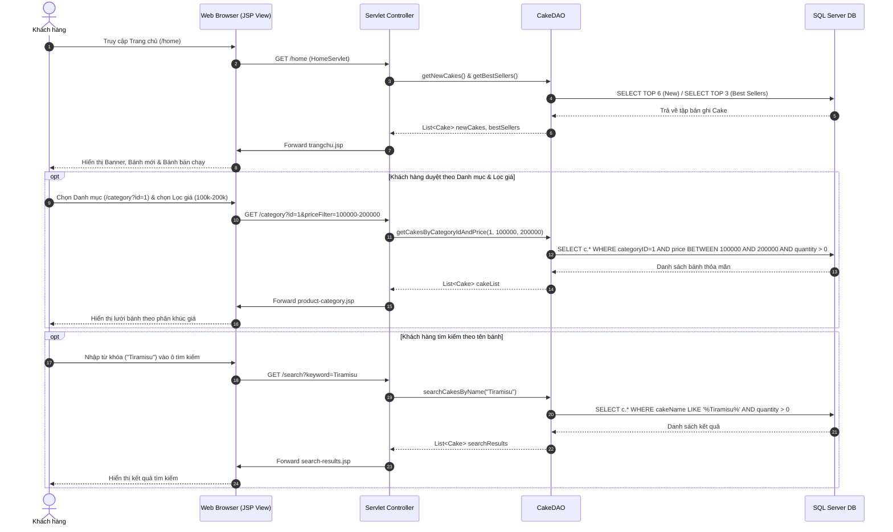
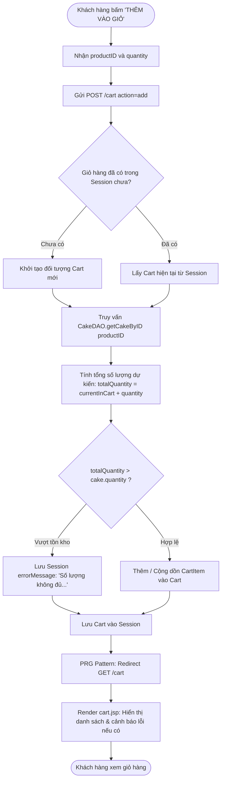
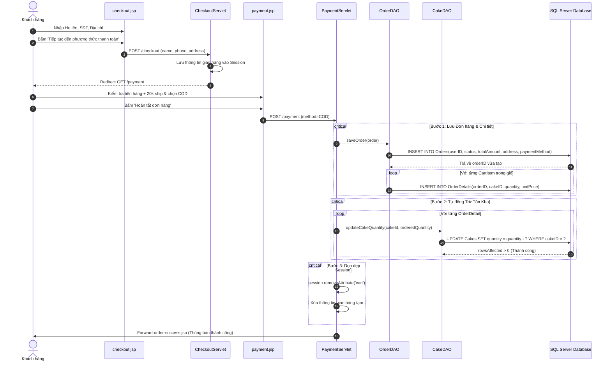

# MÔ HÌNH HÓA QUY TRÌNH NGHIỆP VỤ (BUSINESS PROCESS MODELS)

> **Mã tài liệu**: `DOC-PRO-01`  
> **Dự án**: Website Bán Bánh Ngọt B2C (Memory Lane Sweets)  

Tài liệu này mô hình hóa chi tiết các quy trình nghiệp vụ (Business Processes) của hệ thống bằng sơ đồ chuẩn **Mermaid Sequence Diagram** và **Mermaid Flowchart** có khả năng render trực quan trên GitHub.

---

## 1. SO SÁNH QUY TRÌNH HIỆN TẠI (AS-IS) VS QUY TRÌNH MỚI (TO-BE)

### 1.1. Quy trình AS-IS (Bán hàng truyền thống tại quầy)
* Khách hàng phải đến trực tiếp tiệm bánh hoặc liên hệ qua điện thoại để hỏi danh sách các loại bánh còn trong ngày.
* Nhân viên kiểm tra khay bánh thủ công, ghi hóa đơn giấy hoặc nhập phần mềm POS tại chỗ.
* Rủi ro sai lệch: Bánh đã bán hết nhưng nhân viên vẫn nhận đơn qua điện thoại; thời gian đối soát doanh thu và tồn kho cuối ngày mất nhiều công sức.

### 1.2. Quy trình TO-BE (Website Thương mại Điện tử B2C Memory Lane Sweets)
* Khách hàng truy cập website 24/7, xem hình ảnh thực tế, mô tả thành phần, giá tiền và số lượng tồn kho theo thời gian thực.
* Khách hàng tự tạo giỏ hàng, hệ thống tự động kiểm tra tồn kho và tính tổng tiền minh bạch.
* Đơn hàng được lưu tự động vào CSDL, hệ thống tức thì khấu trừ số lượng tồn kho của bánh, loại bỏ hoàn toàn nguy cơ bán vượt số lượng.

---

## 2. BP-01: QUY TRÌNH KHÁM PHÁ & TÌM KIẾM SẢN PHẨM

---

## 3. BP-02: QUY TRÌNH QUẢN LÝ GIỎ HÀNG & KIỂM SOÁT TỒN KHO

---

## 4. BP-03: QUY TRÌNH ĐẶT HÀNG, LƯU HÓA ĐƠN & TỰ ĐỘNG TRỪ TỒN KHO

---

## 5. CÁC QUY TRÌNH QUẢN TRỊ & MỞ RỘNG (ADMIN ROADMAP)

### 5.1. BP-04: Quy trình Quản trị Sản phẩm & Danh mục (Admin) `[Documented]`
* **Luồng hoạt động**: Admin đăng nhập $\rightarrow$ Truy cập danh sách Bánh $\rightarrow$ Chọn "Thêm mới bánh" hoặc "Sửa bánh" $\rightarrow$ Nhập Tên, Danh mục, Giá, Tồn kho, Ảnh, Mô tả $\rightarrow$ Hệ thống kiểm tra dữ liệu $\rightarrow$ Lưu vào bảng `Cakes` $\rightarrow$ Phản hồi thành công.

### 5.2. BP-05: Quy trình Xử lý Đơn hàng (Admin) `[Documented]`
* **Luồng hoạt động**: Admin vào mục Quản lý đơn hàng $\rightarrow$ Xem danh sách đơn "Chờ xác nhận" $\rightarrow$ Bấm cập nhật trạng thái sang "Đã xác nhận" / "Đang giao" / "Hoàn tất" $\rightarrow$ Hệ thống cập nhật cột `Orders.status` trong CSDL $\rightarrow$ Hỗ trợ in phiếu xuất kho / hóa đơn.

### 5.3. BP-06: Quy trình Đánh giá & Bình luận (Customer Review) `[Documented]`
* **Luồng hoạt động**: Khách hàng đăng nhập $\rightarrow$ Vào trang chi tiết bánh đã mua $\rightarrow$ Chọn số sao (1-5 sao) và viết nhận xét $\rightarrow$ Gửi đánh giá $\rightarrow$ Hệ thống ghi nhận vào bảng `Reviews` (trạng thái `pending` hoặc `active`).
