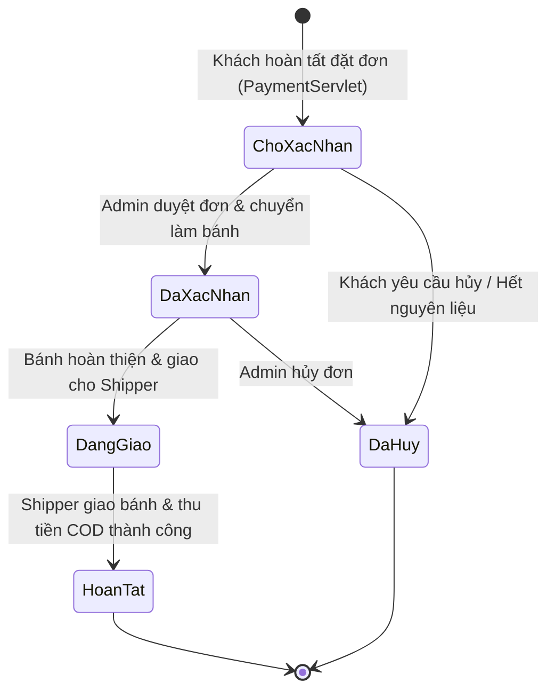

# TỪ ĐIỂN DỮ LIỆU NGHIỆP VỤ (BUSINESS DATA DICTIONARY)

> **Mã tài liệu**: `DOC-DAT-01`  
> **Dự án**: Website Bán Bánh Ngọt B2C (Memory Lane Sweets)  

Tài liệu này định nghĩa cấu trúc chi tiết của tất cả các thực thể dữ liệu (Data Entities), thuộc tính, kiểu dữ liệu, tính bắt buộc, ràng buộc toàn vẹn và ý nghĩa nghiệp vụ trong CSDL `WebBanBanhDB`.

---

## 1. BẢNG: `Users` (Người dùng & Quản trị viên)
* **Ý nghĩa nghiệp vụ**: Lưu trữ thông tin tài khoản của khách hàng thành viên và ban quản trị hệ thống.

| Tên trường (Attribute) | Kiểu dữ liệu | Khóa | Nullable | Ràng buộc nghiệp vụ (Validation & Constraints) | Mô tả nghiệp vụ |
| :--- | :--- | :--- | :--- | :--- | :--- |
| `userID` | `INT` | PK | NO | `IDENTITY(1,1)` | Mã định danh người dùng duy nhất tự tăng. |
| `fullName` | `NVARCHAR(100)` | | NO | Không được để trống | Họ và tên đầy đủ của người dùng. |
| `email` | `VARCHAR(100)` | | NO | `UNIQUE`, Định dạng email hợp lệ | Tên đăng nhập và địa chỉ nhận thông báo. |
| `password` | `VARCHAR(100)` | | NO | Không được để trống | Mật khẩu xác thực tài khoản. |
| `phone` | `VARCHAR(15)` | | YES | `UNIQUE`, 10-11 chữ số | Số điện thoại liên hệ cá nhân. |
| `address` | `NVARCHAR(200)` | | YES | Tối đa 200 ký tự | Địa chỉ nhận hàng mặc định của khách. |
| `role` | `VARCHAR(20)` | | NO | `CHECK (role IN ('admin', 'user'))` | Vai trò: `'admin'` (quản trị) hoặc `'user'` (khách mua). |
| `createdAt` | `DATETIME` | | YES | `DEFAULT GETDATE()` | Thời điểm tạo tài khoản. |

---

## 2. BẢNG: `CakeCategories` (Danh mục Bánh)
* **Ý nghĩa nghiệp vụ**: Phân loại các dòng sản phẩm bánh trong thực đơn của tiệm.

| Tên trường (Attribute) | Kiểu dữ liệu | Khóa | Nullable | Ràng buộc nghiệp vụ | Mô tả nghiệp vụ |
| :--- | :--- | :--- | :--- | :--- | :--- |
| `categoryID` | `INT` | PK | NO | `IDENTITY(1,1)` | Mã số danh mục tự tăng (ID 1: Ngọt, ID 2: Sinh Nhật, ID 3: Mặn, ID 4: Cookie). |
| `categoryName` | `NVARCHAR(100)` | | NO | `UNIQUE` | Tên thương mại của danh mục bánh. |
| `description` | `NVARCHAR(200)` | | YES | Tối đa 200 ký tự | Mô tả ngắn gọn đặc điểm của dòng bánh. |

---

## 3. BẢNG: `Cakes` (Sản phẩm Bánh)
* **Ý nghĩa nghiệp vụ**: Lưu trữ thông tin chi tiết của từng chiếc bánh được kinh doanh.

| Tên trường (Attribute) | Kiểu dữ liệu | Khóa | Nullable | Ràng buộc nghiệp vụ | Mô tả nghiệp vụ |
| :--- | :--- | :--- | :--- | :--- | :--- |
| `cakeID` | `INT` | PK | NO | `IDENTITY(1,1)` | Mã số sản phẩm bánh (SKU). |
| `cakeName` | `NVARCHAR(100)` | | NO | Không được để trống | Tên thương mại của chiếc bánh. |
| `categoryID` | `INT` | FK | NO | `REFERENCES CakeCategories(categoryID)` | Khóa ngoại xác định danh mục bánh. |
| `price` | `DECIMAL(18,0)` | | NO | `CHECK (price >= 0)` | Đơn giá niêm yết của bánh (VNĐ). |
| `quantity` | `INT` | | NO | `CHECK (quantity >= 0)` | Số lượng bánh có sẵn trong kho theo ngày. |
| `imageURL` | `VARCHAR(255)` | | YES | Tên file ảnh trong thư mục `/images` | Đường dẫn file ảnh đại diện của chiếc bánh. |
| `description` | `NVARCHAR(MAX)` | | YES | Không giới hạn độ dài | Bài viết giới thiệu thành phần, hương vị bánh. |
| `createdAt` | `DATETIME` | | YES | `DEFAULT GETDATE()` | Thời điểm thêm bánh vào hệ thống (dùng lọc Bánh Mới). |

---

## 4. BẢNG: `Orders` (Đơn đặt hàng)
* **Ý nghĩa nghiệp vụ**: Lưu thông tin tổng quan của một giao dịch đặt mua bánh.

| Tên trường (Attribute) | Kiểu dữ liệu | Khóa | Nullable | Ràng buộc nghiệp vụ | Mô tả nghiệp vụ |
| :--- | :--- | :--- | :--- | :--- | :--- |
| `orderID` | `INT` | PK | NO | `IDENTITY(1,1)` | Mã số hóa đơn / Đơn đặt hàng duy nhất. |
| `userID` | `INT` | FK | YES | `REFERENCES Users(userID)` (Nullable) | Khách hàng đặt mua (nhận `NULL` nếu là khách vãng lai). |
| `orderDate` | `DATETIME` | | YES | `DEFAULT GETDATE()` | Thời điểm khách hàng hoàn tất đặt đơn. |
| `status` | `NVARCHAR(50)` | | NO | Mặc định: "Chờ xác nhận" | Trạng thái đơn hàng (*Chờ xác nhận, Đang giao, Hoàn tất, Hủy*). |
| `totalAmount` | `DECIMAL(18,0)` | | NO | `CHECK (totalAmount >= 0)` | Tổng giá trị đơn hàng (chưa gồm hoặc đã gồm phí ship). |
| `address` | `NVARCHAR(200)` | | NO | Không được để trống | Địa chỉ nhận bánh thực tế của khách hàng. |
| `paymentMethod` | `NVARCHAR(50)` | | NO | Mặc định: "COD" | Hình thức thanh toán (hiện tại là "COD"). |

---

## 5. BẢNG: `OrderDetails` (Chi tiết Đơn hàng)
* **Ý nghĩa nghiệp vụ**: Lưu trữ danh sách các loại bánh và số lượng của từng món trong một đơn hàng.

| Tên trường (Attribute) | Kiểu dữ liệu | Khóa | Nullable | Ràng buộc nghiệp vụ | Mô tả nghiệp vụ |
| :--- | :--- | :--- | :--- | :--- | :--- |
| `orderDetailID` | `INT` | PK | NO | `IDENTITY(1,1)` | Mã bản ghi chi tiết đơn hàng. |
| `orderID` | `INT` | FK | NO | `REFERENCES Orders(orderID)` | Mã đơn hàng cha sở hữu chi tiết này. |
| `cakeID` | `INT` | FK | NO | `REFERENCES Cakes(cakeID)` | Mã loại bánh được đặt mua. |
| `quantity` | `INT` | | NO | `CHECK (quantity > 0)` | Số lượng bánh đặt mua cho món này. |
| `unitPrice` | `DECIMAL(18,0)` | | NO | `CHECK (unitPrice >= 0)` | Đơn giá của bánh tại thời điểm phát sinh giao dịch. |

* **Ràng buộc duy nhất (Unique Constraint)**: `UNIQUE (orderID, cakeID)` $\rightarrow$ Đảm bảo mỗi loại bánh chỉ xuất hiện tối đa 1 lần trong cùng một đơn hàng (nếu mua thêm thì cộng dồn số lượng).

---

## 6. BẢNG: `Reviews` (Đánh giá Sản phẩm)
* **Ý nghĩa nghiệp vụ**: Lưu trữ điểm đánh giá và nhận xét của khách hàng đối với từng loại bánh.

| Tên trường (Attribute) | Kiểu dữ liệu | Khóa | Nullable | Ràng buộc nghiệp vụ | Mô tả nghiệp vụ |
| :--- | :--- | :--- | :--- | :--- | :--- |
| `reviewID` | `INT` | PK | NO | `IDENTITY(1,1)` | Mã đánh giá tự tăng. |
| `userID` | `INT` | FK | NO | `REFERENCES Users(userID)` | Khách hàng thực hiện đánh giá. |
| `cakeID` | `INT` | FK | NO | `REFERENCES Cakes(cakeID)` | Loại bánh được nhận xét. |
| `rating` | `INT` | | NO | `CHECK (rating BETWEEN 1 AND 5)` | Điểm đánh giá chất lượng (1 đến 5 sao). |
| `comment` | `NVARCHAR(500)` | | YES | Tối đa 500 ký tự | Lời nhận xét chi tiết về sản phẩm. |
| `createdAt` | `DATETIME` | | YES | `DEFAULT GETDATE()` | Thời điểm gửi đánh giá. |
| `status` | `VARCHAR(20)` | | NO | `CHECK in ('active', 'pending', 'hidden')` | Trạng thái hiển thị / kiểm duyệt nhận xét. |

* **Ràng buộc duy nhất**: `UNIQUE (userID, cakeID)` $\rightarrow$ Mỗi khách hàng chỉ được gửi tối đa 1 đánh giá cho mỗi mẫu bánh.

---

## 7. BẢNG: `Shippers` (Đơn vị Giao hàng - Documented Future Entity)
* **Ý nghĩa nghiệp vụ**: Lưu thông tin các đối tác vận chuyển bánh ngọt *(Được thiết kế trong tài liệu, chưa cài đặt SQL)*.

| Tên trường (Attribute) | Kiểu dữ liệu | Khóa | Nullable | Ràng buộc | Mô tả nghiệp vụ |
| :--- | :--- | :--- | :--- | :--- | :--- |
| `shipperID` | `INT` | PK | NO | `IDENTITY(1,1)` | Mã đơn vị vận chuyển. |
| `shipperName` | `NVARCHAR(100)` | | NO | Tối đa 100 ký tự | Tên công ty giao hàng (GHTK, GrabExpress...). |
| `phone` | `VARCHAR(15)` | | YES | Số điện thoại | Đường dây nóng liên hệ đơn vị giao nhận. |

---

## 8. VÒNG ĐỜI VÀ CHUYỂN DỊCH TRẠNG THÁI ĐƠN HÀNG (ORDER STATE TRANSITIONS)

