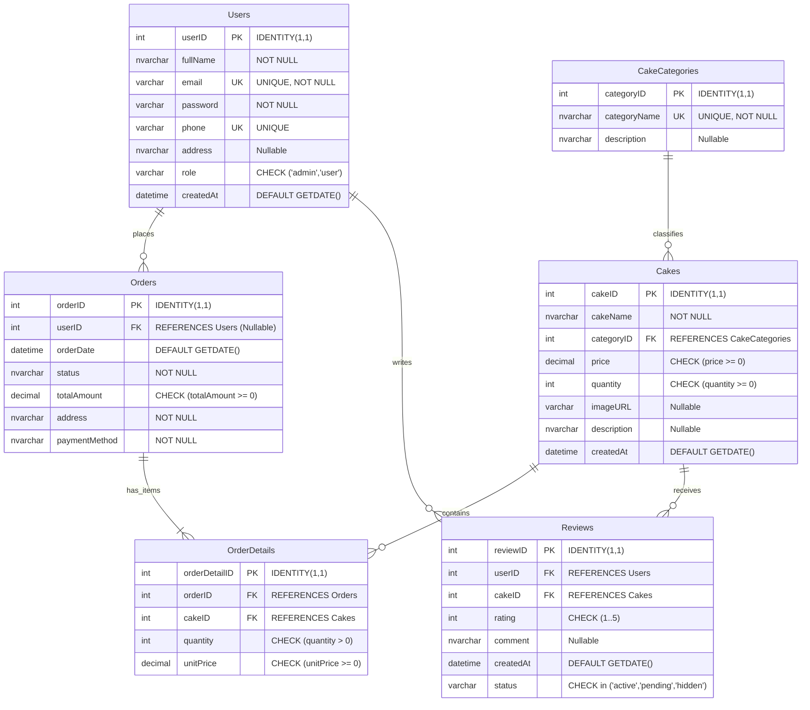

# MÔ HÌNH DỮ LIỆU QUAN HỆ & ERD (ENTITY RELATIONSHIP DIAGRAM)

> **Mã tài liệu**: `DOC-DAT-02`  
> **Dự án**: Website Bán Bánh Ngọt B2C (Memory Lane Sweets)  

Tài liệu này trình bày sơ đồ quan hệ thực thể (ERD) và phân tích các mối liên kết dữ liệu trong CSDL quan hệ `WebBanBanhDB`.

---

## 1. SƠ ĐỒ QUAN HỆ THỰC THỂ (MERMAID ERD DIAGRAM)

---

## 2. PHÂN TÍCH MỐI QUAN HỆ & BẢN SỐ (CARDINALITY ANALYSIS)

1. **Users (1) ——— (0..N) Orders**:
   * Một khách hàng thành viên có thể đặt 0 hoặc nhiều đơn hàng theo thời gian.
   * Một đơn hàng có thể gắn với 1 tài khoản `userID` hoặc nhận giá trị `NULL` nếu là đơn hàng của khách vãng lai.
2. **Orders (1) ——— (1..N) OrderDetails**:
   * Mỗi đơn hàng bắt buộc phải có ít nhất 1 dòng chi tiết mặt hàng và có thể chứa nhiều dòng chi tiết khác nhau.
   * Mỗi dòng chi tiết thuộc về duy nhất một đơn hàng cha.
3. **Cakes (1) ——— (0..N) OrderDetails**:
   * Một loại bánh có thể được đặt mua trong nhiều đơn hàng khác nhau.
   * Mỗi dòng chi tiết chỉ tham chiếu đến duy nhất 1 loại bánh cụ thể.
4. **CakeCategories (1) ——— (0..N) Cakes**:
   * Một danh mục có thể chứa nhiều loại bánh khác nhau (hoặc chưa có bánh nào khi mới tạo danh mục).
   * Mỗi chiếc bánh bắt buộc phải thuộc về đúng 1 danh mục (`categoryID`).
5. **Users (1) ——— (0..N) Reviews**:
   * Một người dùng có thể viết nhận xét đánh giá cho nhiều loại bánh khác nhau.
6. **Cakes (1) ——— (0..N) Reviews**:
   * Một chiếc bánh có thể nhận được nhiều đánh giá từ các khách hàng khác nhau.

---

## 3. RÀNG BUỘC TOÀN VẸN DỮ LIỆU & CHIẾN LƯỢC ĐÁNH CHỈ MỤC (INDEXING STRATEGY)

* **Ràng buộc duy nhất kết hợp**:
  * `UNIQUE (orderID, cakeID)` trên bảng `OrderDetails`: Ngăn chặn việc tạo 2 dòng riêng biệt cho cùng 1 loại bánh trong 1 đơn hàng (thay vào đó phải cộng dồn `quantity`).
  * `UNIQUE (userID, cakeID)` trên bảng `Reviews`: Ngăn chặn hành vi spam đánh giá nhiều lần cho cùng 1 sản phẩm từ 1 tài khoản.
* **Chỉ mục đề xuất tối ưu truy vấn (Index Recommendations)**:
  * Index trên `Cakes(categoryID, price)`: Tăng tốc độ truy vấn lọc danh mục theo khoảng giá.
  * Index trên `Cakes(createdAt DESC)`: Tăng tốc độ lấy Top 6 sản phẩm mới tại Trang chủ.
  * Index trên `Orders(userID)` & `Orders(orderDate DESC)`: Tăng tốc độ xem lịch sử đơn hàng của khách hàng.
