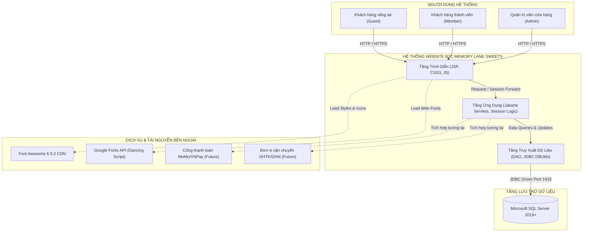
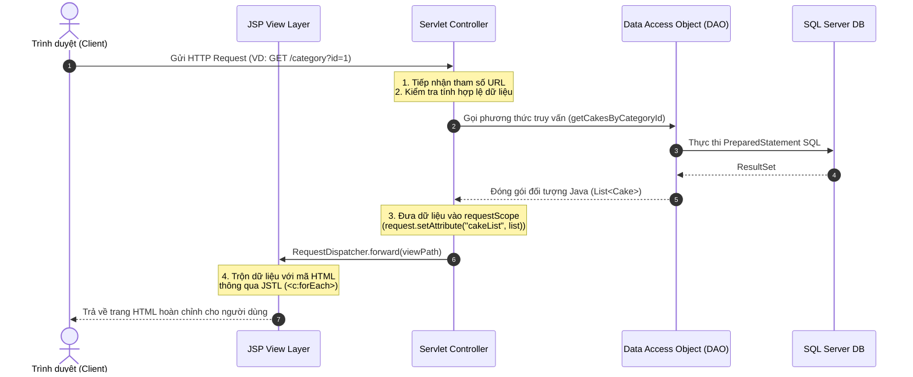

# KIẾN TRÚC HỆ THỐNG & MÔ HÌNH NGỮ CẢNH (SYSTEM ARCHITECTURE & CONTEXT)

> **Mã tài liệu**: `DOC-INT-01`  
> **Dự án**: Website Bán Bánh Ngọt B2C (Memory Lane Sweets)  

Tài liệu này mô tả chi tiết kiến trúc phân tầng (Three-tier Architecture), mô hình điều phối MVC (Model - View - Controller), sơ đồ ngữ cảnh hệ thống (System Context) và các giao thức kết nối dữ liệu.

---

## 1. MÔ HÌNH NGỮ CẢNH HỆ THỐNG (SYSTEM CONTEXT DIAGRAM)



---

## 2. KIẾN TRÚC 3 TẦNG (THREE-TIER ARCHITECTURE)

Hệ thống được thiết kế phân tầng nghiêm ngặt theo chuẩn Enterprise Java Web:

```
+-------------------------------------------------------------------------+
|                  1. PRESENTATION LAYER (TẦNG TRÌNH DIỄN)                 |
|  - Trình duyệt Web (Chrome, Edge, Firefox, Safari)                      |
|  - Giao diện JSP (JavaServer Pages), CSS3 (checkout_payment.css...),    |
|    JavaScript client-side validation, JSTL Core & Formatting Tags        |
+-------------------------------------------------------------------------+
                                    |  HTTP Request / Response
                                    v
+-------------------------------------------------------------------------+
|             2. APPLICATION / LOGIC LAYER (TẦNG NGHIỆP VỤ & ĐIỀU PHỐI)   |
|  - Web Server: Apache Tomcat 10+                                         |
|  - Controller Servlets: HomeServlet, CategoryServlet, ProductDetailServlet|
|    SearchServlet, CartServlet, CheckoutServlet, PaymentServlet          |
|  - Session-based Memory Caching: Cart, CartItem, User Session State      |
|  - Business Validation: Stock Reservation, Flat-rate Shipping Calculator |
+-------------------------------------------------------------------------+
                                    |  Java Method Calls
                                    v
+-------------------------------------------------------------------------+
|             3. DATA ACCESS LAYER & DATABASE (TẦNG DỮ LIỆU)              |
|  - Data Access Objects: CakeDAO.java, OrderDAO.java                      |
|  - Connection Manager: DBUtils.java (JDBC Connection Pool)              |
|  - RDBMS: Microsoft SQL Server (WebBanBanhDB)                           |
+-------------------------------------------------------------------------+
```

---

## 3. DÒNG CHẢY ĐIỀU PHỐI MVC (MVC INTERACTION LIFECYCLE)



---

## 4. QUẢN LÝ KẾT NỐI VÀ TÍCH HỢP HỆ THỐNG

* **JDBC Driver Configuration (`DBUtils.java`)**:
  * Driver Class: `com.microsoft.sqlserver.jdbc.SQLServerDriver`
  * Connection String: `jdbc:sqlserver://localhost:1433;databaseName=WebBanBanhDB;encrypt=false;trustServerCertificate=true;`
  * Quản lý kết nối tự động đóng qua cấu trúc `try-with-resources`.
* **Cơ chế quản lý phiên (Session Management)**:
  * Được cấu hình trong `web.xml` với thời gian sống 30 phút (`<session-timeout>30</session-timeout>`).
  * Đối tượng `Cart` được gắn vào `sessionScope.cart` giúp khách hàng duyệt nhiều trang mà không bị mất giỏ hàng.
