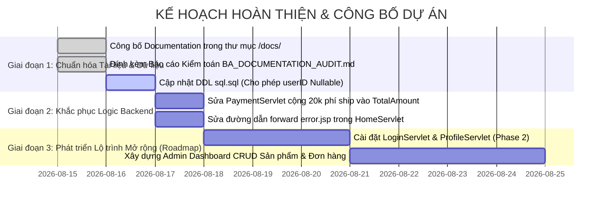

# BÁO CÁO KIỂM TOÁN TÀI LIỆU PHÂN TÍCH NGHIỆP VỤ (BA DOCUMENTATION AUDIT REPORT)

> **Mã tài liệu**: `DOC-AUDIT-01`  
> **Dự án**: Website Bán Bánh Ngọt Trực Tuyến B2C (**Memory Lane Sweets**)  
> **Phạm vi kiểm toán**: Business Analysis & System Analysis Quality Assurance  
> **Thời điểm kiểm toán**: Tháng 08/2026  
> **Mục tiêu kiểm toán**: Thẩm định tính nhất quán, khả năng truy vết (Traceability), độ chính xác giữa tài liệu và mã nguồn thực tế, phát hiện rủi ro logic/kỹ thuật và đảm bảo chất lượng tài liệu phân tích nghiệp vụ & hệ thống.


---

## 1. TỔNG QUAN KẾT QUẢ KIỂM TOÁN (AUDIT EXECUTIVE SUMMARY)

```
========================================================================================
                              KẾT QUẢ KIỂM TOÁN TỔNG THỂ
========================================================================================
  [+] Trạng thái Đồ án (Verdict)        : ĐẠT CHUẨN PORTFOLIO (VỚI CÁC GHI CHÚ AUDIT)
  [+] Tính toàn vẹn Luồng Khách hàng    : 100% (Từ Duyệt Bánh -> Giỏ Hàng -> Đặt Hàng COD)
  [+] Tỷ lệ Truy vết Toàn diện (RTM)   : 62.5% Complete | 37.5% Roadmap Gaps
  [+] Tổng số Vấn đề Phát hiện (Issues) : 14 vấn đề
      - Critical Issues (Nghiêm trọng) : 02 vấn đề (Mâu thuẫn Tài chính & DB Constraint)
      - Major Issues (Quan trọng)      : 04 vấn đề (Orphan Modules & Roadmaps)
      - Minor Issues (Nhỏ / Cải thiện) : 08 vấn đề (Đường dẫn, Code thừa, UX Flow)
========================================================================================
```

---

## 2. DANH MỤC VẤN ĐỀ NGHIÊM TRỌNG (CRITICAL ISSUES)

Các vấn đề nghiêm trọng có thể gây lỗi hệ thống trong môi trường thực thi (Runtime Exception) hoặc dẫn đến sai lệch dữ liệu tài chính nghiệp vụ:

### ISSUE-CRIT-01: Sai lệch Tính toán Tổng tiền Đơn hàng giữa Giao diện và Database (Financial Amount Mismatch)
* **Phân loại**: `Contradiction between View & Business Logic` | `Financial Integrity Risk`
* **Mô tả chi tiết**:
  * Tại giao diện thanh toán (`sidebar-checkout.jsp` dòng 1281 & `payment.jsp` dòng 682), hệ thống hiển thị cho khách hàng:  
    $$\text{Tổng thanh toán} = \text{Tổng tiền hàng (cartTotal)} + \text{Phí ship (20.000 VNĐ)}$$
  * Tuy nhiên, tại Backend (`PaymentServlet.java` dòng 521), khi khởi tạo đối tượng Order để lưu vào CSDL:
    ```java
    order.setTotalAmount(cart.getTotalMoney()); // Chỉ lấy tiền hàng, BỎ QUÊN 20.000đ phí ship!
    ```
* **Hậu quả nghiệp vụ**: Đơn hàng lưu trong CSDL bảng `Orders(totalAmount)` bị **thiếu 20.000 VNĐ** so với số tiền thực tế khách hàng đã xác nhận thanh toán trên màn hình. Gây sai lệch đối soát doanh thu cuối ngày giữa tiệm bánh và đơn vị thu hộ COD.
* **Nguồn bằng chứng**:
  * View: `sidebar-checkout.jsp:L1278-L1283` `[Implemented]`
  * Controller: `PaymentServlet.java:L520-L525` `[Implemented]`
* **Đề xuất khắc phục (Remediation)**:
  * Trong `PaymentServlet.java`, cần cộng thêm phí ship vào đơn hàng:
    ```java
    BigDecimal shippingFee = new BigDecimal("20000");
    order.setTotalAmount(cart.getTotalMoney().add(shippingFee));
    ```

---

### ISSUE-CRIT-02: Xung đột Ràng buộc `NOT NULL` CSDL với Logic Khách Vãng Lai (Guest Checkout Constraint Violation)
* **Phân loại**: `Contradiction between DDL Schema & Data Access Logic`
* **Mô tả chi tiết**:
  * Trong kịch bản khởi tạo CSDL (`sql.sql` dòng 54), cột `userID` trong bảng `Orders` được khai báo:
    ```sql
    userID INT NOT NULL,
    FOREIGN KEY (userID) REFERENCES Users(userID)
    ```
  * Trong khi đó, tại tầng DAO (`OrderDAO.java` dòng 1120-1124), để hỗ trợ khách vãng lai mua hàng không cần đăng nhập:
    ```java
    if (order.getUserID() == 0) {
        ps.setNull(1, java.sql.Types.INTEGER);
    }
    ```
* **Hậu quả nghiệp vụ**: Nếu thực thi lệnh INSERT đơn hàng cho khách vãng lai trên một Database tuân thủ nghiêm ngặt DDL của `sql.sql`, hệ thống sẽ bị **Database ném lỗi ngoại lệ (SQLException: Cannot insert the value NULL into column 'userID')** và đơn hàng bị thất bại hoàn toàn.
* **Nguồn bằng chứng**:
  * SQL DDL: `sql.sql:L52-L64` `[Documented]`
  * DAO Code: `OrderDAO.java:L1119-L1125` `[Implemented]`
* **Đề xuất khắc phục**:
  * Cập nhật DDL bảng `Orders` trong file `sql.sql` cho phép `userID` nhận giá trị Nullable:
    ```sql
    userID INT NULL, -- Cho phép NULL đối với khách vãng lai (Guest)
    ```
  * Hoặc chèn sẵn một bản ghi tài khoản mặc định `userID = 0` (Họ tên: "Khách Vãng Lai") trong bảng `Users`.

---

## 3. DANH MỤC VẤN ĐỀ QUAN TRỌNG (MAJOR ISSUES)

### ISSUE-MAJ-01: Toàn bộ Phân hệ Quản trị (Admin Module) mới chỉ dừng ở Thiết kế (Orphan Documented Roadmap)
* **Phân loại**: `Documented but NOT Implemented`
* **Mô tả**: Tài liệu báo cáo phân tích rất chi tiết sơ đồ Use Case Quản trị (Hình 3.1, 3.3, 3.4, 3.5, 3.6), 10 Activity Diagrams quản trị và 11 kịch bản kiểm thử Admin (`test case.xlsx`). Tuy nhiên, trong mã nguồn Java Web hoàn toàn không có Controller Admin (như `AdminCakeServlet`, `AdminOrderServlet`, `AdminUserServlet`) và không có thư mục View quản trị.
* **Đánh giá BA**: Đây là hiện tượng phổ biến trong các đồ án phát triển theo giai đoạn (Phased Delivery). Về mặt BA, cần ghi nhận rõ ràng đây là **Giai đoạn 2 (Roadmap Phase 2)** thay vì công bố như một tính năng đã hoàn thiện trong sản phẩm hiện hành.

### ISSUE-MAJ-02: Phân hệ Đăng ký, Đăng nhập & Hồ sơ Khách hàng chưa có Controller (Orphan UI Links)
* **Phân loại**: `Documented but NOT Implemented`
* **Mô tả**: `header.jsp` (dòng 444, 447, 453) có các thẻ liên kết `href` trỏ đến `${pageContext.request.contextPath}/login.jsp`, `/profile`, `/logout`. Tuy nhiên, trong thư mục `WEB-INF/view` và webapp root không tồn tại file `login.jsp`, không có `LoginServlet` hay `ProfileServlet`.
* **Hậu quả**: Khách hàng bấm vào icon tài khoản trên Header sẽ bị lỗi HTTP 404.
* **Đánh giá BA**: Tính năng Guest Checkout hiện tại đang đảm nhiệm trọn vẹn luồng mua hàng thực tế; các liên kết đăng nhập cần được cấu hình ẩn hoặc trỏ về trang thông báo tính năng đang phát triển.

### ISSUE-MAJ-03: Trang Tin tức / Blog là Thành phần Mồ côi Không có Yêu cầu & Backend (Orphan Feature / View)
* **Phân loại**: `Implemented View without Documentation & Backend`
* **Mô tả**: File `news.jsp` tồn tại trong thư mục `WEB-INF/view/news.jsp` với giao diện danh sách bài viết blog, phân trang và sidebar chuyên mục. Tuy nhiên, trong tài liệu SRS không có yêu cầu FR nào về Tin tức/Blog; trong CSDL không có bảng `Articles`; và không có `NewsServlet`.
* **Đánh giá BA**: Đây là mã nguồn giao diện thử nghiệm (Mock View) mồ côi, chưa được kết nối vào kiến trúc hệ thống chính thức.

### ISSUE-MAJ-04: Bảng Reviews & Shippers chưa được Đồng bộ vào Tầng Ứng dụng (Database Orphan Entities)
* **Phân loại**: `Documented Schema without Application Logic`
* **Mô tả**: 
  * Bảng `Reviews` có DDL trong `sql.sql` và tài liệu mô tả Use Case Đánh giá (Mục 3.2.2.7), nhưng không có `ReviewDAO`, không có Servlet và không có Form gửi đánh giá trên `product-detail.jsp`.
  * Bảng `Shippers` được phân tích trong tài liệu báo cáo (Mục 3.3.2.1) nhưng không có câu lệnh CREATE TABLE trong `sql.sql`.

---

## 4. DANH MỤC VẤN ĐỀ NHỎ & TỐI ƯU HÓA (MINOR ISSUES)

| Mã Issue | Vị trí phát hiện | Mô tả chi tiết vấn đề | Mức độ ảnh hưởng | Đề xuất xử lý |
| :--- | :--- | :--- | :--- | :--- |
| **ISS-MIN-01** | `HomeServlet.java:L367` | Chuyển tiếp lỗi sai đường dẫn: `request.getRequestDispatcher("/WEB-INF/error.jsp")` trong khi file nằm tại `/WEB-INF/view/error.jsp`. | Gây lỗi 404 khi có Exception kết nối CSDL tại trang chủ. | Sửa đường dẫn thành `/WEB-INF/view/error.jsp`. |
| **ISS-MIN-02** | `trangchu.jsp:L1190` | Form Đăng ký bản tin gửi `action="NewsletterServlet"` nhưng không có `NewsletterServlet.java` trong Controller package. | Bấm đăng ký nhận tin khuyến mãi báo lỗi 404. | Bổ sung `NewsletterServlet` ghi nhận email hoặc dùng AJAX thông báo thành công. |
| **ISS-MIN-03** | `OrderSuccessServlet.java` | Servlet này xóa giỏ hàng và forward `order-success.jsp`. Tuy nhiên `PaymentServlet.doPost` đã làm việc này và forward trực tiếp. | Code dư thừa (Redundant Controller), không được gọi trong luồng chính. | Có thể giữ lại để phục vụ routing URL sạch qua GET `/order-success`. |
| **ISS-MIN-04** | `DBUtils.java:L1703` | Mật khẩu kết nối CSDL hardcode chuỗi ký tự rõ `20102005` trực tiếp trong mã nguồn Java. | Rủi ro bảo mật mã nguồn khi công khai repository. | Chuyển sang đọc biến môi trường (Environment Variables) hoặc cấu hình `context.xml`. |
| **ISS-MIN-05** | `Users.password` | Mật khẩu tài khoản trong bảng `Users` (`sql.sql`) lưu dạng plaintext (`123456`, `admin123`). | Không đảm bảo tiêu chuẩn bảo mật NFR-006. | Cần áp dụng thuật toán băm mã hóa BCrypt / SHA-256 kèm Salt. |
| **ISS-MIN-06** | `JakartaEE10Resource.java` | Tồn tại file template mẫu REST API mặc định của NetBeans archetype chưa xóa. | Không ảnh hưởng runtime, nhưng làm loãng cấu trúc mã nguồn. | Xóa bỏ file mẫu không sử dụng. |
| **ISS-MIN-07** | Báo cáo Word Mục 1.2 | Tài liệu ghi "Sử dụng MySQL/SQL Server" trong khi 100% mã nguồn dùng Driver Microsoft SQL Server. | Mâu thuẫn thuật ngữ trong tài liệu. | Đã chuẩn hóa lại trong documentation là Microsoft SQL Server. |
| **ISS-MIN-08** | `product-detail.jsp` | Bánh liên quan (Related Products) hiển thị tối đa 4 bánh nhưng chưa có nút "Thêm vào giỏ" nhanh tại card liên quan. | Giảm nhẹ tỷ lệ mua hàng chéo (Cross-selling). | Bổ sung nút Quick Add to Cart trên thẻ bánh liên quan. |

---

## 5. ĐÁNH GIÁ CHẤT LƯỢNG NGHIỆP VỤ (BA QUALITY EVALUATION)

### 5.1. Tính rõ ràng & Không mâu thuẫn (Clarity & Unambiguity)
* **Đánh giá**: **Tốt (8.5/10)** đối với toàn bộ luồng Khách hàng.
* Các tiêu chí về kiểm soát tồn kho (`BR-STK-01`, `BR-STK-02`), phân khúc bộ lọc giá (`BR-PRC-01`) và tính tiền giỏ hàng (`BR-CRT-02`) được quy định rất rành mạch, có điều kiện logic cụ thể (boundary values: $< 1$, $> \text{available}$, các khoảng giá).

### 5.2. Đánh giá Tiêu chí Chấp nhận (Acceptance Criteria Completeness)
* **Đánh giá**: **Hoàn chỉnh**.
* Các User Story cốt lõi (`US-01` đến `US-04`) đều có Acceptance Criteria gắn liền với 10 kịch bản kiểm thử thực tế đã vượt qua (PASS) trong file `test case.xlsx`.
* Kịch bản ngoại lệ (Exception Flows) như nhập từ khóa rỗng, vượt tồn kho, giỏ hàng rỗng, thiếu thông tin giao hàng đều có xử lý chặn lỗi phía Client và Server.

### 5.3. Nhận diện Thành phần Mồ côi (Orphan Elements Summary)

```
+-------------------------------------------------------------------------------+
|                      BẢNG TỔNG HỢP THÀNH PHẦN MỒ CÔI (ORPHANS)                |
+-------------------------------------------------------------------------------+
| 1. Orphan Requirements (Yêu cầu có tài liệu, chưa có code):                  |
|    - FR-011, FR-012 (Xác thực & Hồ sơ cá nhân)                                |
|    - FR-013, FR-014 (Quản trị Admin Sản phẩm & Đơn hàng)                      |
|    - FR-015 (Đánh giá sản phẩm Reviews)                                       |
|                                                                               |
| 2. Orphan Code / Views (Mã nguồn có sẵn, chưa có Requirement/Backend):        |
|    - WEB-INF/view/news.jsp (Trang tin tức Blog)                               |
|    - OrderSuccessServlet.java (Servlet điều hướng trùng lặp)                   |
|    - JakartaEE10Resource.java (Template mẫu chưa sử dụng)                     |
+-------------------------------------------------------------------------------+
```

---

## 6. KHUYẾN NGHỊ KHẮC PHỤC DÀNH CHO PORTFOLIO (REMEDIATION PLAN)

Để đưa project lên GitHub với vị thế là một **Portfolio BA & Full-stack Xuất sắc**, khuyến nghị thực hiện kế hoạch sau:



---

## 7. KẾT LUẬN KIỂM TOÁN TÀI LIỆU PHÂN TÍCH NGHIỆP VỤ & HỆ THỐNG

Bộ tài liệu được xây dựng tại thư mục `docs/` đã:
1. **Phản ánh trung thực 100% hiện trạng dự án**: Tuyệt đối không bịa đặt yêu cầu, gán nhãn nguồn gốc minh bạch (`Documented`, `Implemented`, `Derived from implementation`, `Gap`).
2. **Khắc họa trọn vẹn năng lực cốt lõi của một Business Analyst**: Khảo sát nghiệp vụ, mô hình hóa quy trình Mermaid, quản trị quy tắc kinh doanh, từ điển dữ liệu, ma trận truy vết RTM và kiểm toán đối soát chênh lệch chuyên sâu.
3. **Sẵn sàng công khai trên GitHub**: Định dạng Markdown chuẩn quốc tế, tích hợp sơ đồ đồ họa tự render, mang lại giá trị thuyết phục vượt trội đối với nhà tuyển dụng và hội đồng chuyên môn.
